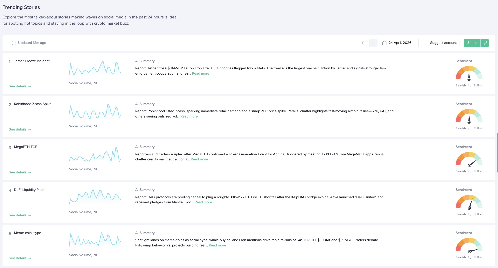

## Definition

**Trending Stories** is a list of stories — clusters of related messages
discussing the same topic — that attracted the most social attention over the
last 24 hours. While [Trending Words](/metrics/emerging-trends) surface
individual trending _words_, Trending Stories group related messages into a
single narrative and return a human-readable title, a summary of what is being
discussed, the related tokens, and bullish/bearish sentiment ratios.

The stories are built on top of [social data](/metrics/details/social-data/) by
clustering semantically similar messages, scoring each cluster by its volume and
velocity, and ranking the clusters in descending order of that score.

---

## Access

The metric's real-time data is **free**.
The metric's historical data has [restricted access](/metrics/details/access#restricted-access).

---

## Measuring Unit

Each story has a `score` that reflects how much social attention the story is
getting. It has no absolute qualitative meaning — the higher the score, the
more a given story is trending relative to the rest.

Two additional per-story numbers — `bullishRatio` and `bearishRatio` — describe
the sentiment split of the messages in the cluster.

---

## Data Type

[Timeseries Data](/metrics/details/data-type#timeseries-data)

---

## Frequency

Trending Stories are available at [hourly intervals](/metrics/details/frequency#hourly-frequency)

---

## Latency

Trending Stories have [social data Latency](/metrics/details/latency#social-data-latency)

---

## Available Sources

Trending Stories can be computed per data source via the `source` argument:

- `TWITTER_CRYPTO`
- `TELEGRAM`

---

## How to Access

### [SanAPI](https://api.santiment.net)

Trending stories are available as part of the API, the metric is called
`getTrendingStories`:

```graphql
{
  getTrendingStories(
    from: "2024-01-01T12:00:00Z"
    to: "2024-01-01T13:00:00Z"
    size: 10
    interval: "1h"
  ) {
    datetime
    topStories {
      title
      summary
      searchText
      score
      bullishRatio
      bearishRatio
      relatedTokens
    }
  }
}
```

**[Run in Explorer](<https://api.santiment.net/graphiql?variables=&query=%7B%0A%20%20getTrendingStories(from%3A%20%222024-01-01T12%3A00%3A00Z%22%2C%20to%3A%20%222024-01-01T13%3A00%3A00Z%22%2C%20size%3A%2010%2C%20interval%3A%20%221h%22%2C%20source%3A%20TWITTER_CRYPTO)%20%7B%0A%20%20%20%20datetime%0A%20%20%20%20topStories%20%7B%0A%20%20%20%20%20%20title%0A%20%20%20%20%20%20summary%0A%20%20%20%20%20%20searchText%0A%20%20%20%20%20%20score%0A%20%20%20%20%20%20bullishRatio%0A%20%20%20%20%20%20bearishRatio%0A%20%20%20%20%20%20relatedTokens%0A%20%20%20%20%7D%0A%20%20%7D%0A%7D%0A>)**
