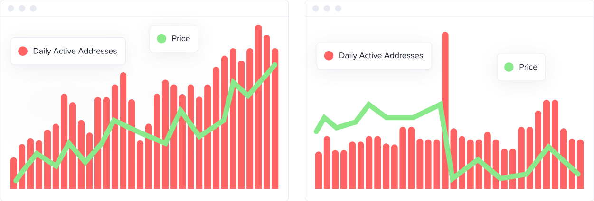
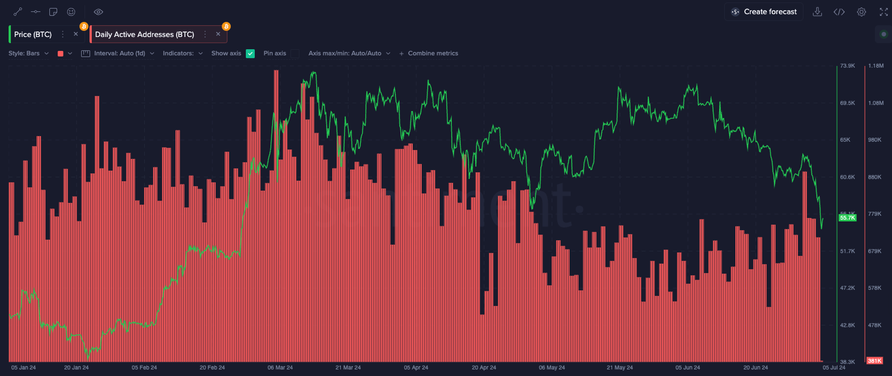
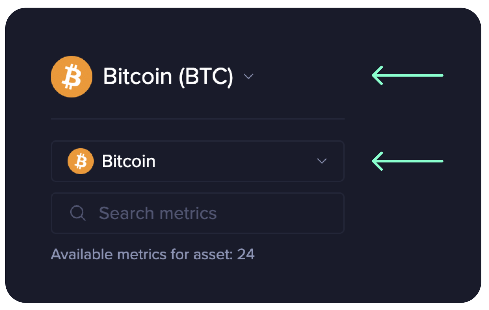

<iframe width="560" height="315"
src="https://www.youtube.com/embed/qcy7ZTne-h8?si=DV_O-5Crkqx1FQYx"
title="YouTube video player" frameborder="0" allow="accelerometer; autoplay;
clipboard-write; encrypted-media; gyroscope; picture-in-picture; web-share"
referrerpolicy="strict-origin-when-cross-origin" allowfullscreen></iframe>

## Definition

DAA is the amount of unique active addresses that participate in transactions
on a blockchain network each day. It's a measure of the network's activity and
usage. High DAA suggests strong user engagement and network utility. DAA can be
influenced by various factors like market trends, network upgrades, or major
events.

## How to interpret the Daily Active Addresses metric

Generally, there's a correlation between DAA and price. For instance:

- **Positive Correlation**: When DAA rises, it often signals increased interest
  and price movement. For example, during periods when Ethereum's DAA
  increased, we observed a positive price trend, even if the price was
  initially wobbly.
- **Long-term Growth**: Consistent, long-term growth in DAA is a positive sign,
  indicating rising utility and potential for price appreciation.
- **Market Top Indicator**: A sudden spike in DAA can sometimes indicate a
  market top, signalling a rush of activity before a sell-off.

Daily Active Addresses (DAA) is a powerful metric when combined with others
like Whale Transactions. DAA shows network activity, while Whale Transactions
highlight big player movements. For instance, a spike in DAA with high Whale
Transactions can indicate upcoming volatility.

<Notebox type="exclamation">
Context is crucial, so we strongly suggest not to make trading decisions based
solely on this metric. Use a combination of metrics that will help you make a
more informed decision.
</Notebox>

## How to monitor DAA using Sanbase

Here is a ready-to-be-copied Layout with Trading and Transaction volume for
your convenience: [Sanbase Daily Active Addresses Chart](https://app.santiment.net/charts/daily-active-addresses-25309)

As soon as you have adjusted the Chart based on your preferences (time
intervals, colors, etc.) you can save it as a new private Layout. Then, using
the Master selector (the bigger one on the top) you can change the currently
analysed token to another while your visual preferences and metrics remain the
same.

Or you can use the smaller selector to build on top of your chart and insert
more metrics, even for multiple tokens at once.

See what others in crypto can’t!

<Notebox type="pointRight">
More technical documentation about the metric can be found here: [Daily Active
Addresses | Santiment Academy](/metrics/daily-active-addresses)
</Notebox>
