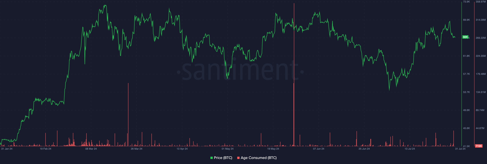
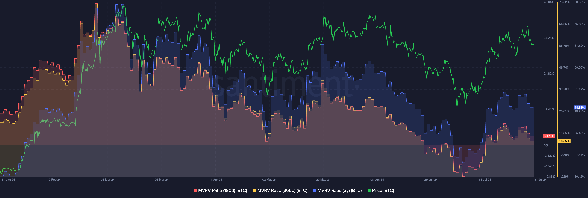
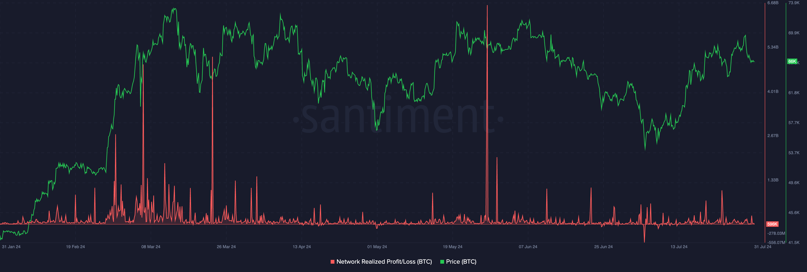
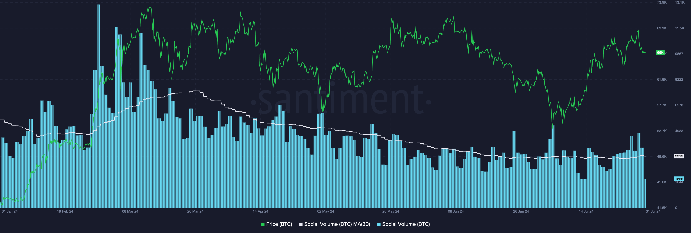

## Overview

This framework aims to help traders and investors identify the current stage in
a long-term market cycle. 

For the purpose, we will use a layout with five charts with key indicators. We
will use BTC as a proxy.

Key indicators are:

- Spikes in age consumed
- Changes in mean dollar age
- Divergence between MVRV and price
- Profit and loss levels
- Social volume trends

Open this layout with five charts and let’s dive in:

[Sanbase Charts | Long-term market cycle](https://app.santiment.net/charts/long-term-market-cycle-24503)

<iframe width="560" height="315" src="https://www.youtube.com/embed/7UJIjj4uUPs?si=fyfKFHWSUO7_XdgV" title="YouTube video player" frameborder="0" allow="accelerometer; autoplay; clipboard-write; encrypted-media; gyroscope; picture-in-picture; web-share" referrerpolicy="strict-origin-when-cross-origin" allowfullscreen></iframe>

## [Age Consumed](/metrics/age-consumed)

Key metric on chart 1 of the layout is age consumed, which represents amounts
of coins that moved multiplied by the time that they spent in the last address.
Large spikes of this metric mean that long-term holders are moving their funds,
which often marks key turning points for the market.

<Notebox type="arrowRight">
Age Consumed - the number of coins changing addresses on a certain date,
multiplied by the time since they last moved.
</Notebox>

<Notebox type="dart">
Identify critical market turning points by monitoring significant spikes.
</Notebox>

<Notebox type="brain">
Spikes indicate long-term holders moving their funds, often signalling major
market shifts.
</Notebox>

## [Mean Dollar Invested Age (MDIA)](/metrics/mean-coin-age)

On chart 2 of the layout, you can see mean dollar age metrics, one of which is
measuring this value for all coins, while the other one is only looking at
coins moved within the last 365 days. These metrics help gauge the macro trend
strength. When the value drops, that indicates inflow of new money, and the
inverse indicates that money isn’t coming in. They usually start falling around
the middle of the bull market, acting as a confirmation of strength. Change of
mode from down to up often predicts major market tops.

<Notebox type="arrowRight">
MDIA - the average age of every dollar invested into the market cap of a coin.
</Notebox>

<Notebox type="dart">
Gauge the strength of the macro trend using two MDIA metrics: one for all coins
and one for coins moved within the last 365 days.
</Notebox>

<Notebox type="brain">
Changes in these metrics from downward to upward trends signal macro trend exhaustion.

Dropping Values show inflow of new money, typically post-bull market midpoint, confirming market strength.

Rising Values show lack of new money, often predicting major market tops.
</Notebox>

## [MVRV Ratio](/metrics/mvrv)

Chart 3 of the layout has MVRV ratios  (Market Value to Realized Value) with
different timeframes. Here, the same idea of coins moved within specific time
applies. The key idea here is to look for divergences between MVRV and price.
MVRV diverging from price can be only caused by the change in realized value.
When realized value rises, that means on average market participants are buying
in at the highs, indicating “greed” mode of the market, and price tends to
trend down as a result. The opposite applies as well. When participants are
selling at the lows and realizing losses, the realized value drops and that
causes MVRV ratio to diverge to the upside.

<Notebox type="arrowRight">
MVRV Ratio - an asset's market capitalization divided by realized capitalization.
</Notebox>

<Notebox type="dart">
Observe divergences between MVRV and price by analyzing MVRVs for different
timeframes based on coin movements.
</Notebox>

<Notebox type="brain">
Rising Realized Value indicates "greed," often leading to a downward trend.

Dropping Realized Value indicates losses, causing MVRV to diverge upwards.

Divergences reveal market sentiment and potential price movements.
</Notebox>

## [Network Realized Profit and Loss](/metrics/network-profit-loss)

Network Realized Profit/Loss on chart 4 of the layout measures the collective
PnL of all holders. Big negative spikes are usually the best long-term buy
signals. Spotting the tops, however, works a bit different - the biggest spikes
are happening around mid-bull market. But after that, when the price continues
higher but NRPL stays close to 0, this usually means that the market’s top is
near.

<Notebox type="arrowRight">
Network Realized Profit/Loss - the average profit or loss of all coins that change addresses daily.
</Notebox>

<Notebox type="dart">
Identify optimal buying opportunities and potential market peaks.

</Notebox>

<Notebox type="brain">
Big Negative Spikes indicate the best longterm buy signals.
Mid-Bull Market Spikes signify significant profit-taking.
Price rising with NRPL Near 0 suggests an approaching market top.
</Notebox>

## [Social Volume](/metrics/social-volume)

Social volume on panel 5 indicates the amount of discussion in crypto social
media. You generally want to get in when the amount of chatter is low, and the
average Joe isn’t interested in crypto at all, but when everyone is only taking
about Bitcoin, it’s best to consider an exit or partial profit taking strategy.

<Notebox type="arrowRight">
Social Volume - the total number of social media messages that contain the
given search term at least once.
</Notebox>

<Notebox type="dart">
Effectively time market entries and exits by monitoring social volume.
</Notebox>

<Notebox type="brain">
Low chatter periods are ideal entry points when interest in crypto is minimal.
High chatter signals that it’s time to consider your exit strategy as interest peaks.
</Notebox>

All of these metrics will help you better understand the crypto market trends
on a macro level and make more informed decisions.

[Sanbase Charts | Long-term market cycle](https://app.santiment.net/charts/long-term-market-cycle-24503)

Feel free to save the layout with charts as your own and use the master
selector (the top one) to observe the same metrics for various tokens.

See what others in crypto can’t!
