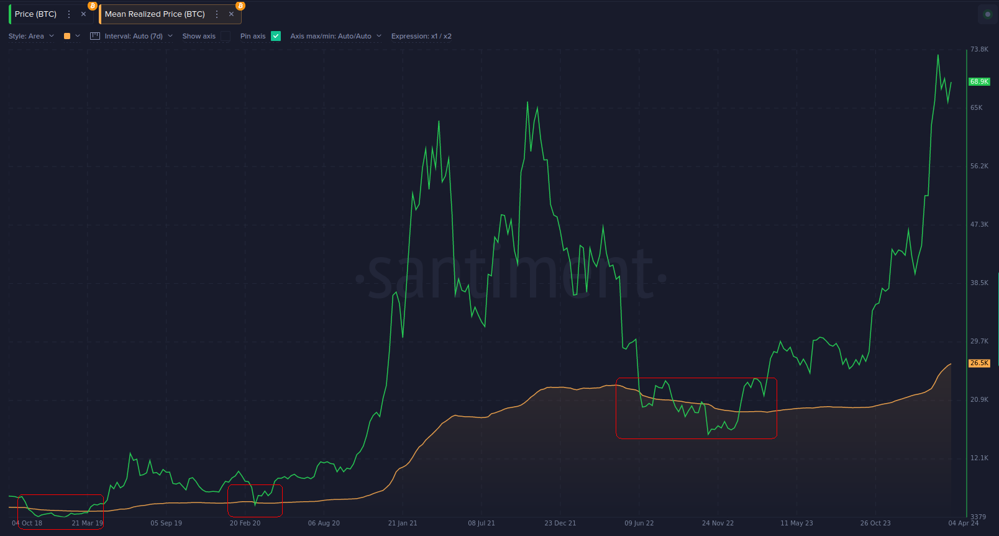

## Definition

The Mean Realized Price metric calculates the average price at which tokens were obtained.
It provides insights into the average profitability of token transactions by considering the 
[Realized Value](/metrics/realized-value) against the [Total Circulating](/metrics/circulation) 
tokens. It can be understood as the price level that acts as support or resistance.

$$
\text{mean\_realized\_price\_usd} = \frac{\text{realized\_value\_usd}}{\text{circulation}}
$$

Mean Realized Price metric is also available for different [time bounds](/metrics/details/timebound), which 
computes the mean realized price for tokens moved at least once no longer than a specific number of days or years ago.


### Bottom Indicator Use Case



The Mean Realized Price carries considerable weight for crypto investors. In times of market instability, 
it serves as a crucial indicator. If the price falls below the Mean Realized Price, it suggests that, 
on average, token holders are facing unrealized losses. These periods are highlighted on the chart 
above (red rectangles), and investors view them as opportunities to accumulate more tokens.

---

## Access

[Restricted Access](/metrics/details/access#restricted-access).

---

## Timebound

[Timebound Metrics](/metrics/details/timebound) available

---

## Measuring Unit

USD

---

## Data Type

[Timeseries Data](/metrics/details/data-type#timeseries-data)

---

## Frequency

[Daily Intervals](/metrics/details/frequency#daily-frequency)

---

## Latency

[On-Chain Latency](/metrics/details/latency#on-chain-latency)

---

## Available Assets

Available for [these assets](<https://api.santiment.net/graphiql?variables=&query=%7B%0A%20%20getMetric(metric%3A%20%22mean_realized_price_usd%22)%20%7B%0A%20%20%20%20metadata%20%7B%0A%20%20%20%20%20%20availableSlugs%0A%20%20%20%20%7D%0A%20%20%7D%0A%7D%0A>)

> Note: `mean_realized_price_usd` metric and all timebound realized value metrics are
> available for the same set of assets.

---

## SanAPI

Available under the `mean_realized_price_usd` and `mean_realized_price_usd_<timebound>` names.

```graphql
{
  getMetric(metric: "mean_realized_price_usd") {
    timeseriesData(
      slug: "santiment"
      from: "2020-01-01T00:00:00Z"
      to: "2020-01-07T00:00:00Z"
      interval: "1d"
    ) {
      datetime
      value
    }
  }
}
```

**[Run in Explorer](<https://api.santiment.net/graphiql?query=%7B%0A%20%20getMetric(metric%3A%20%22mean_realized_price_usd%22)%20%7B%0A%20%20%20%20timeseriesData(%0A%20%20%20%20%20%20slug%3A%20%22santiment%22%0A%20%20%20%20%20%20from%3A%20%222020-01-01T00%3A00%3A00Z%22%0A%20%20%20%20%20%20to%3A%20%222020-01-07T00%3A00%3A00Z%22%0A%20%20%20%20%20%20interval%3A%20%221d%22%0A%20%20%20%20)%20%7B%0A%20%20%20%20%20%20datetime%0A%20%20%20%20%20%20value%0A%20%20%20%20%7D%0A%20%20%7D%0A%7D>)**

## Full list of metrics

<Details>
<Summary>Mean Realized Price metrics</Summary>
- mean_realized_price_usd
- mean_realized_price_usd_1d
- mean_realized_price_usd_7d
- mean_realized_price_usd_30d
- mean_realized_price_usd_60d
- mean_realized_price_usd_90d
- mean_realized_price_usd_180d
- mean_realized_price_usd_365d
- mean_realized_price_usd_2y
- mean_realized_price_usd_3y
- mean_realized_price_usd_5y
- mean_realized_price_usd_10y
</Details>
